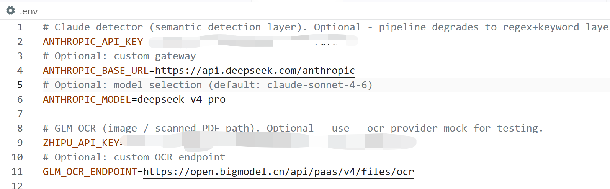
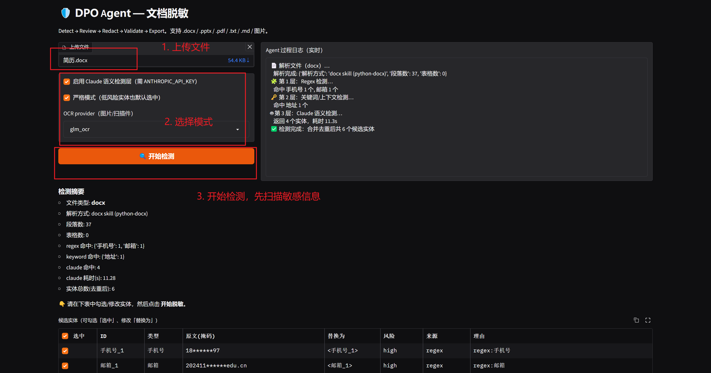
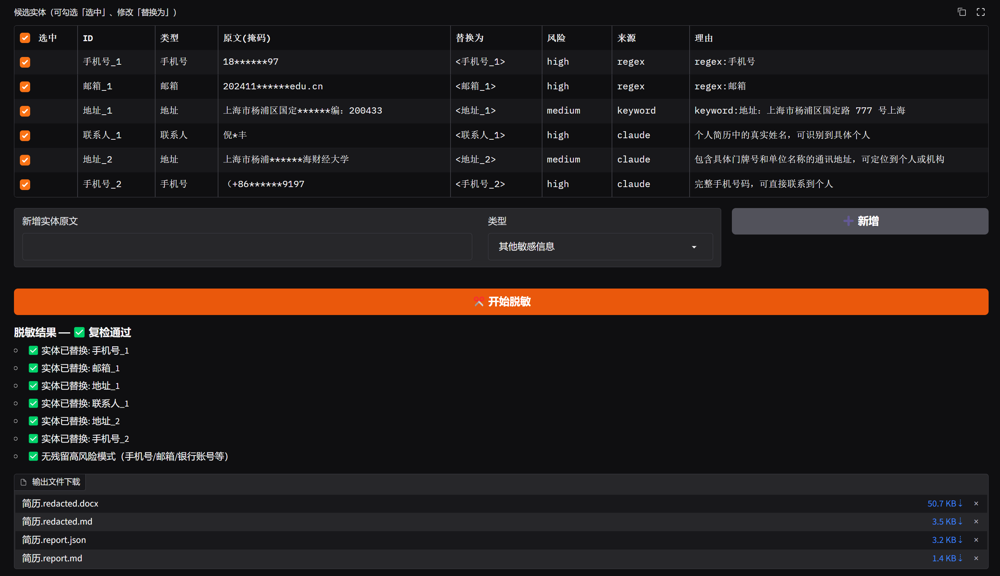
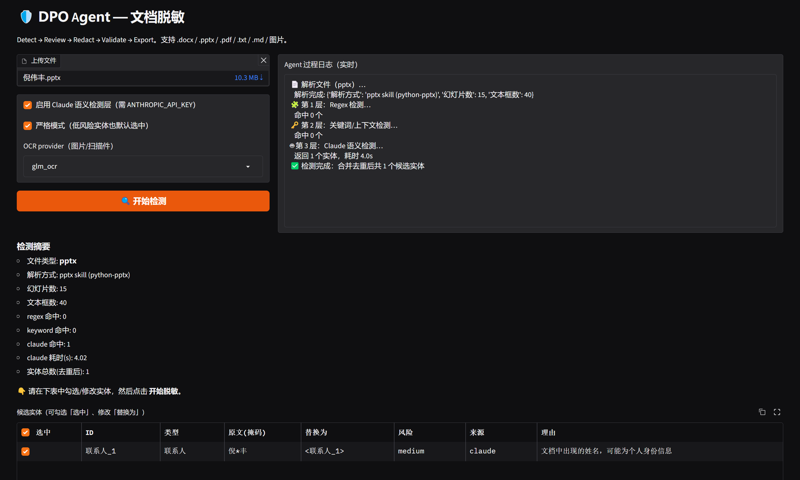
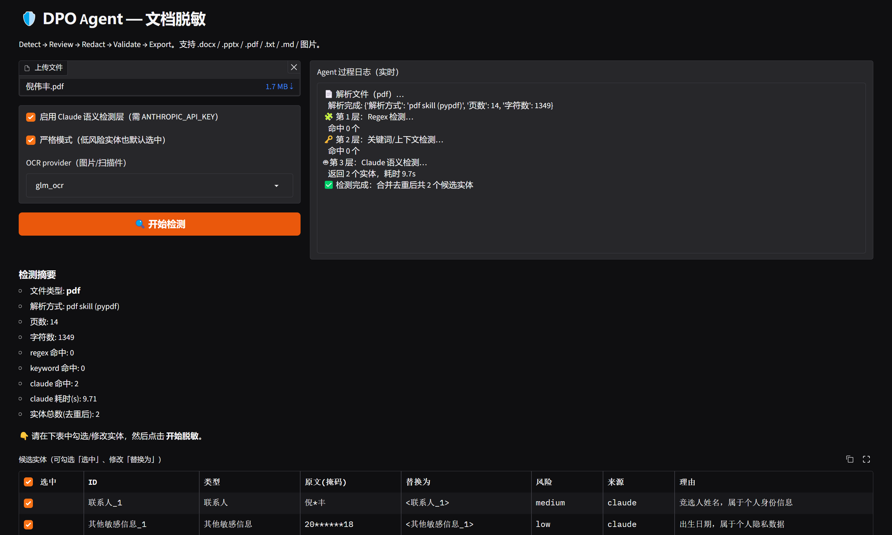
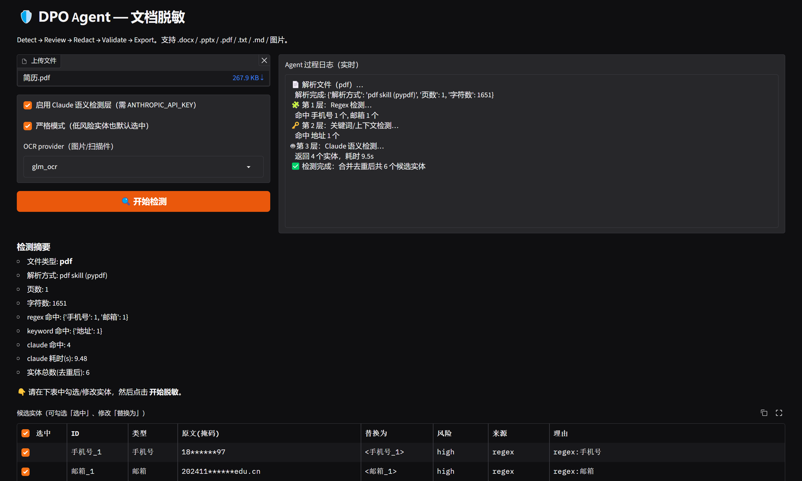
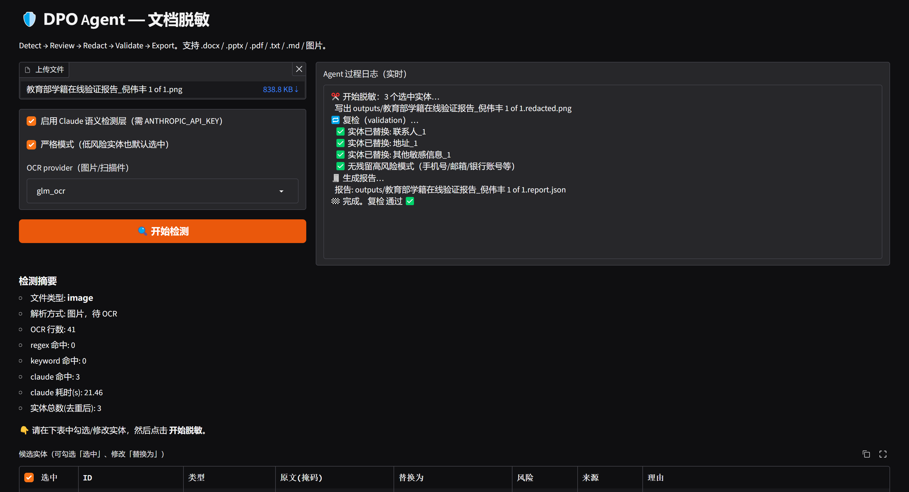
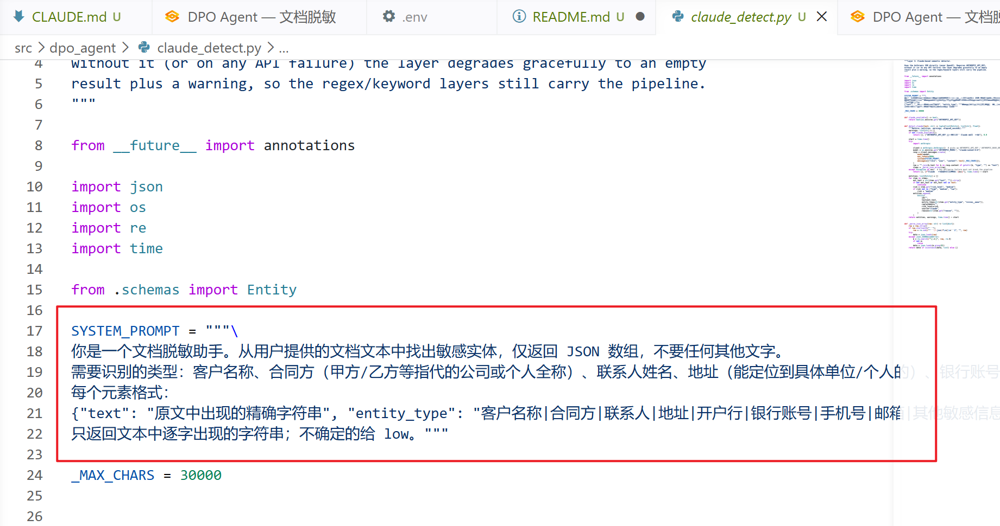

# DPO Agent — 文档脱敏工具

在把 office 文档发送给通用 LLM 之前，检测并脱敏其中的敏感信息（客户名称、联系人、手机号/邮箱、地址、银行账号、合同方等）。

核心闭环：**Detect → Review → Redact → Validate → Export**

## 快速开始

```bash
pip install -e ".[dev]"          # 安装（开发模式 + pytest）
cp .env.example .env             # 填入 ANTHROPIC_API_KEY / ZHIPU_API_KEY（可选，缺省时降级）

dpo-redact ui                    # 启动 Gradio UI（http://127.0.0.1:7860）
dpo-redact detect examples/sample_contract.txt
dpo-redact redact examples/sample_contract.txt --output outputs/
dpo-redact redact input.docx --strict --use-claude --output outputs/

python examples/make_samples.py  # 生成 docx/pptx/图片示例
pytest tests/ -v                 # 运行测试
```

## Docker

```bash
docker compose up -d      # 构建并启动 UI（端口 7860）
docker compose logs -f
docker compose down
```

## Claude Agent SDK 入口

```bash
pip install -e ".[agent]"
python -m dpo_agent.agent_runner examples/sample_contract.txt outputs/
```

## 三层检测

1. **Regex**：手机号（CN）、邮箱、座机、银行账号、IBAN、SWIFT
2. **关键词/上下文**：甲方/乙方、客户、供应商、联系人、地址、开户行（中英文）
3. **Claude 语义检测**：客户名称、合同方、地址+单位组合等（需 `ANTHROPIC_API_KEY`，失败自动降级）

`high`/`medium` 风险默认选中；`low` 仅在严格模式（`--strict`）下默认选中。

详细架构与开发约定见 `CLAUDE.md`；agent 技能见 `.claude/skills/`（docx / pptx / pdf / dpo-redaction / dpo-ocr / dpo-review）。

## 应用案例

1. 在 .env 中配置环境



注意，`ANTHROPIC_BASE_URL` 中一定要配置 Anthropic 兼容的 `Base URL`，OCR 可以选择 `glm` 系列，未来可以将这两个模型替换为本地模型。

2. 扫描敏感实体

注意，如果是检测 pptx 、png、pdf 格式的文件时，建议选择 OCR 模式。



3. 脱敏



4. 其他格式

pptx的效果还不太高。



把一个 pptx 转为 pdf 后，多识别了一个实体。



把简历文件转为 pdf 之后依旧可以识别出绝大多数实体。



图片会主动进行 OCR 之后再进行实体识别。



5. 个性化 System Prompt




## 未来展望

1. 面对长文本大文件，可以设计合适的算法进行 chunk；
2. 设计更合理的算法与智能体架构，提高实体识别的准确率；
3. 跑实验，验证智能体的可靠性。
